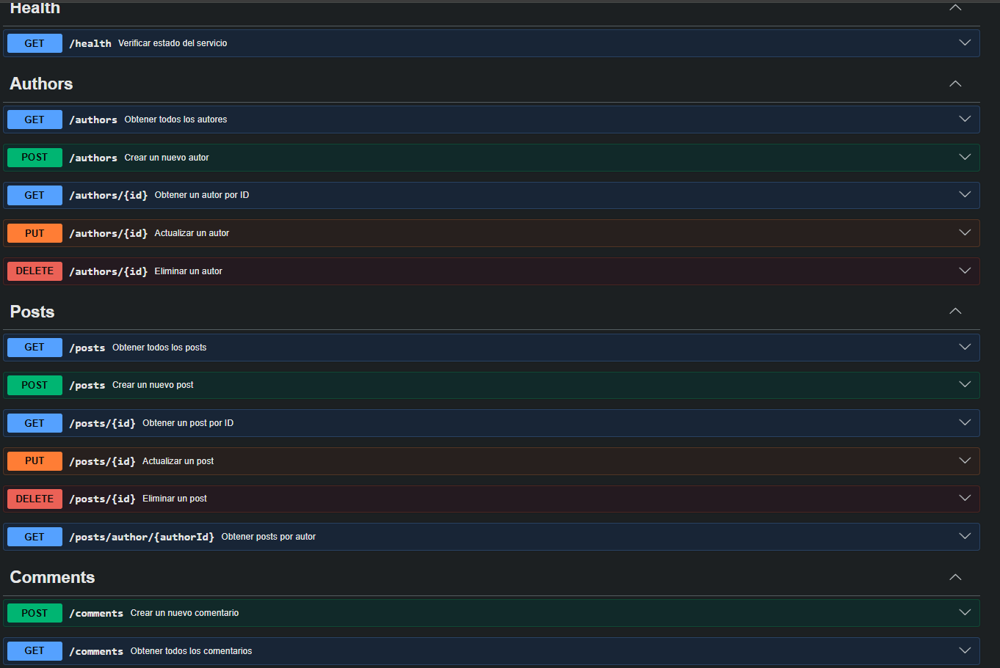
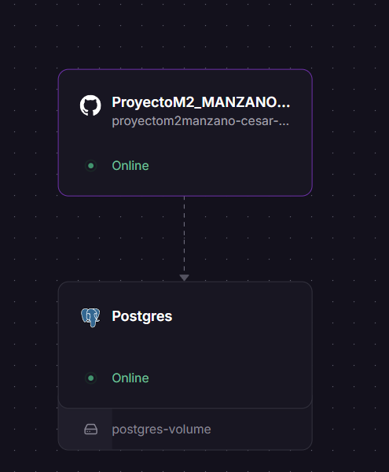
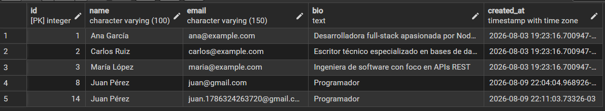
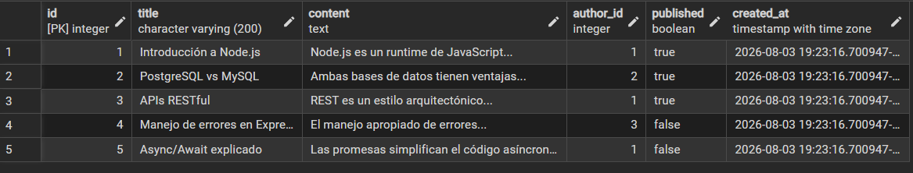
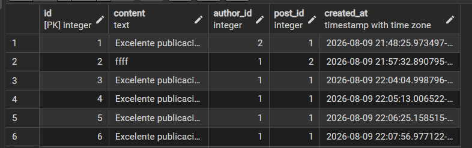
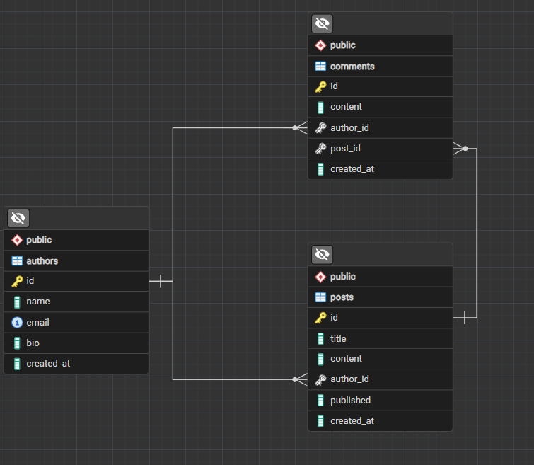

# API de Autores, Posts y Comentarios

## 📚 Documentación de la API

👉 [Swagger / OpenAPI - Documentación de la API](https://proyectom2manzano-cesar-luis-production-ec6b.up.railway.app/api-docs)

---

## 📌 Descripción

API REST desarrollada con **Node.js y Express** para gestionar autores, publicaciones y comentarios.

El proyecto utiliza **PostgreSQL** como base de datos e implementa operaciones CRUD, validaciones, middlewares, pruebas automatizadas y documentación mediante **Swagger / OpenAPI**.




La aplicación se encuentra desplegada en **Railway**.



---

## 🚀 Tecnologías utilizadas

- Node.js
- Express
- PostgreSQL
- Swagger / OpenAPI
- Vitest
- Supertest
- Railway
- dotenv


---

## 🌐 Ejecución en servidor

La API se encuentra desplegada en **Railway**, por lo que puede utilizarse directamente desde el servidor sin necesidad de realizar una configuración local.

👉 [Swagger / OpenAPI - API desplegada](https://proyectom2manzano-cesar-luis-production-ec6b.up.railway.app/api-docs)

Desde Swagger se pueden consultar y probar los diferentes endpoints de la API.


---

## 💻 Ejecución local

El proyecto también puede ejecutarse de forma local utilizando **Node.js, Express y PostgreSQL**.

Para ejecutar la API localmente es necesario contar con:

- Node.js instalado.
- PostgreSQL instalado y ejecutándose.
- Una base de datos PostgreSQL local.
- Las dependencias del proyecto instaladas.

### 1. Clonar el proyecto

```bash
git clone https://github.com/cesarmanzano1/PROYECTOM2_MANZANO-CESAR-LUIS.git
cd PROYECTOM2_MANZANO-CESAR-LUIS
---

## 📂 Entidades

### 👤 Authors

La entidad `authors` representa a los autores de las publicaciones.



### 📝 Posts

La entidad `posts` representa las publicaciones realizadas por los autores.




### 💬 Comments

La entidad `comments` representa los comentarios realizados sobre las publicaciones.




---

## 🔗 Relaciones

- Un autor puede tener muchos posts.
- Un post pertenece a un autor.
- Un autor puede realizar muchos comentarios.
- Un comentario pertenece a un autor y a un post.
---

## 🗄️ Base de datos

El proyecto utiliza **PostgreSQL** para la persistencia de los datos.



---

## 📡 Endpoints

### ❤️ Health Check

| Método | Endpoint | Descripción |
|---|---|---|
| GET | `/health` | Verificar el estado de la API |

### 👤 Authors

| Método | Endpoint | Descripción |
|---|---|---|
| GET | `/authors` | Obtener todos los autores |
| GET | `/authors/:id` | Obtener un autor por ID |
| POST | `/authors` | Crear un nuevo autor |
| PUT | `/authors/:id` | Actualizar un autor |
| DELETE | `/authors/:id` | Eliminar un autor |

### 📝 Posts

| Método | Endpoint | Descripción |
|---|---|---|
| GET | `/posts` | Obtener todos los posts |
| GET | `/posts/:id` | Obtener un post por ID |
| GET | `/posts/author/:authorId` | Obtener los posts de un autor |
| POST | `/posts` | Crear un nuevo post |
| PUT | `/posts/:id` | Actualizar un post |
| DELETE | `/posts/:id` | Eliminar un post |

### 💬 Comments

| Método | Endpoint | Descripción |
|---|---|---|
| GET | `/comments` | Obtener todos los comentarios |
| POST | `/comments` | Crear un nuevo comentario |

---

## ✅ Validaciones

La API cuenta con middlewares para validar los datos recibidos.

### Authors

Se validan los siguientes campos:

- `name`
- `email`
- `bio`

También se verifica que el correo electrónico tenga un formato válido y unico.

### Posts

Se validan:

- `author_id`
- `title`
- `content`
- `published`

El campo `published` debe ser de tipo booleano.

### Comments

Se validan:

- `content`
- `author_id`
- `post_id`

También se verifica que los identificadores sean números enteros positivos y que el contenido no esté vacío.

---

## 🤖 Uso de Inteligencia Artificial

Durante el desarrollo del proyecto se utilizó Inteligencia Artificial como herramienta de apoyo para:

- Analizar y corregir errores en el código.
- Ayudar en la creación de pruebas con Vitest y Supertest.
- Orientar en la documentación con Swagger / OpenAPI.
- Revisar la estructura y organización del proyecto.
- Resolver inconvenientes durante el deployment en Railway.

La IA fue utilizada como herramienta de apoyo al desarrollo y aprendizaje, realizando posteriormente las modificaciones, pruebas y verificaciones correspondientes sobre el código.

---


## 📁 Estructura del proyecto

```text
PROYECTOM2_MANZANO-CESAR-LUIS/
│
├── docIA/
│
├── img/
│
├── src/
│   ├── config/
│   │   ├── constsConfig.js
│   │   ├── dbConnect.js
│   │   └── initDB.js
│   │
│   ├── controllers/
│   │   ├── authors.Controller.js
│   │   ├── comments.controller.js
│   │   ├── health.controller.js
│   │   └── post.controller.js
│   │
│   ├── middleware/
│   │   └── middleware.js
│   │
│   ├── router/
│   │   └── router.js
│   │
│   ├── test/
│   │   └── server.test.js
│   │
│   ├── server.js
│   └── swagger.js
│
├── .env.example
├── .gitignore
├── enlaces.txt
├── index.js
├── package-lock.json
├── package.json
├── README.md
└── vitest.config.js