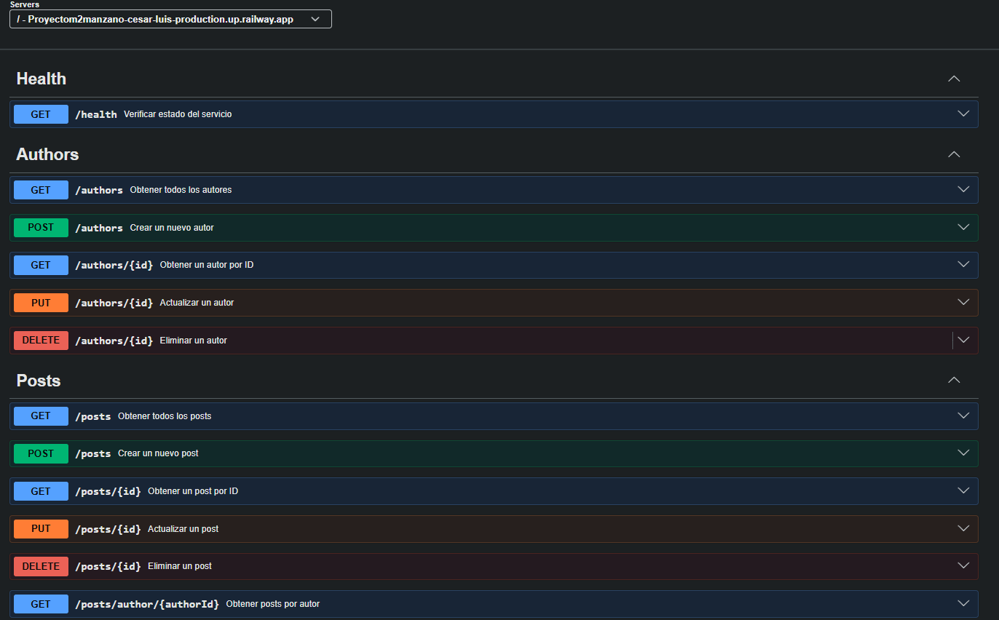
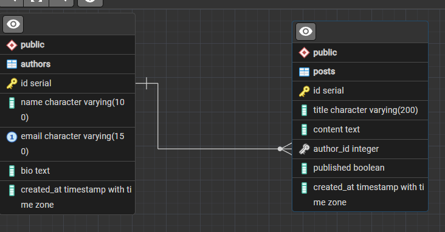
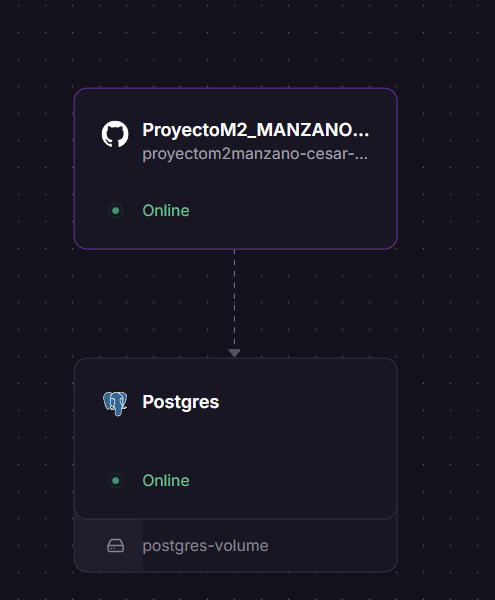

# 📚 API de Autores y Posts — Proyecto M2

API REST desarrollada con **Node.js y Express** para gestionar autores y publicaciones.

El proyecto utiliza **PostgreSQL** como base de datos e implementa:

* Operaciones CRUD para autores y posts.
* Validaciones mediante middlewares.
* Pruebas automatizadas con **Vitest y Supertest**.
* Documentación de la API mediante **Swagger / OpenAPI**.
* Persistencia de datos mediante PostgreSQL.
* Despliegue en **Railway**.
* Configuración mediante variables de entorno.

---

## 🚀 Tecnologías utilizadas

* **Node.js**
* **Express**
* **PostgreSQL**
* **pg**
* **dotenv**
* **Swagger / OpenAPI**
* **Vitest**
* **Supertest**
* **Railway**
* **Git / GitHub**

---

# 📚 Documentación de la API

La API cuenta con documentación interactiva mediante **Swagger / OpenAPI**.

### Swagger en producción

👉 **[Abrir Swagger / OpenAPI](https://proyectom2manzano-cesar-luis-production.up.railway.app/api-docs)**



Desde Swagger se pueden consultar y probar los diferentes endpoints de la API.

---

# 💻 Ejecución local

## Requisitos

Para ejecutar el proyecto localmente es necesario tener instalado:

* **Node.js**
* **PostgreSQL**
* **Git**

Además, se necesita una base de datos PostgreSQL local.

---

## 1. Clonar el repositorio

```bash
git clone https://github.com/cesarmanzano1/ProyectoM2_MANZANO-CESAR-LUIS-.git

```

```bash
cd PROYECTOM2_MANZANO-CESAR-LUIS
```
---

## 2. Instalar las dependencias

Ejecutar:

```bash
npm install
```

---

## 3. Crear la base de datos

Crear una base de datos PostgreSQL llamada, por ejemplo:


```sql
CREATE DATABASE blog_db;
```

Luego conectarse a esa base de datos:

```sql
\c blog_db
```

---

## 4. Configurar las variables de entorno

Crear un archivo `.env` en la raíz del proyecto.

Para la ejecución local se utilizan las siguientes variables:

```env
DB_HOST=localhost
DB_PORT=5432
DB_NAME=blog_db
DB_USER=postgres
DB_PASSWORD=tu_contraseña
NODE_ENV=development
PORT=3000

```

Los valores deben modificarse de acuerdo con la configuración local de PostgreSQL.

> ⚠️ El archivo `.env` no debe subirse a GitHub porque puede contener información sensible, como la contraseña de PostgreSQL.

El proyecto incluye un archivo `.env.example` como referencia.

---

## 5. Ejecutar el setup de la base de datos

El proyecto cuenta con un archivo de inicialización de la base de datos ubicado en:

```text
src/config/initDB.js
```

Este archivo se encarga de crear las tablas necesarias para el funcionamiento de la API.

La base de datos se inicializa automáticamente al ejecutar la aplicación:

```bash
npm start
```

Una vez ejecutado, la base de datos contará con las tablas necesarias para trabajar con:

* `authors`
* `posts`

---
## 6. Cargar datos de prueba (opcional)
El proyecto permite cargar datos de ejemplo para facilitar las pruebas de los endpoints de autores y publicaciones.

Para cargar los datos de prueba, ejecuta:

```bash
npm run db:seed
```

Este comando ejecuta el archivo src/config/run-seed-sql.js, que lee y ejecuta las consultas SQL definidas en:

src/base_de_datos/seed.sql

Los datos de ejemplo incluyen:

3 autores.
5 posts asociados a sus respectivos autores.

> ⚠️Importante: antes de ejecutar este comando, asegurarse de haber configurado correctamente las variables de entorno y de que la base de datos PostgreSQL esté disponible.

La carga de datos es opcional y se utiliza para facilitar las pruebas manuales de la API.

## 7. Ejecutar la API

Para iniciar el servidor:

```bash
npm start
```

La API estará disponible localmente en:

```text
http://localhost:3000

```

---

# 📖 Documentación OpenAPI local

Con el servidor ejecutándose, Swagger estará disponible en:

```text
http://localhost:3000/api-docs
```

También se puede consultar la especificación OpenAPI en:

```text
http://localhost:3000/api-docs.json
```

---

# 🗄️ Base de datos

El proyecto utiliza **PostgreSQL** para almacenar la información.

Las principales tablas utilizadas son:

### Authors

```text
authors
├── id
├── name
├── email
├── bio
└── created_at
```

### Posts

```text
posts
├── id
├── title
├── content
├── author_id
├── published
└── created_at
```

La relación entre las tablas es:

* Un autor puede tener muchos posts.
* Cada post pertenece a un autor mediante `author_id`.



---

# 📡 Endpoints principales

## ❤️ Health Check

| Método | Endpoint  | Descripción                   |
| ------ | --------- | ----------------------------- |
| GET    | `/health` | Verificar el estado de la API |

---

## 👤 Authors

| Método | Endpoint       | Descripción               |
| ------ | -------------- | ------------------------- |
| GET    | `/authors`     | Obtener todos los autores |
| GET    | `/authors/:id` | Obtener un autor por ID   |
| POST   | `/authors`     | Crear un nuevo autor      |
| PUT    | `/authors/:id` | Actualizar un autor       |
| DELETE | `/authors/:id` | Eliminar un autor         |

---

## 📝 Posts

| Método | Endpoint                  | Descripción                   |
| ------ | ------------------------- | ----------------------------- |
| GET    | `/posts`                  | Obtener todos los posts       |
| GET    | `/posts/:id`              | Obtener un post por ID        |
| GET    | `/posts/author/:authorId` | Obtener los posts de un autor |
| POST   | `/posts`                  | Crear un nuevo post           |
| PUT    | `/posts/:id`              | Actualizar un post            |
| DELETE | `/posts/:id`              | Eliminar un post              |

---

# ✅ Validaciones

La API cuenta con middleware para validar los datos recibidos.

## Authors

Se validan:

* `name`
* `email`
* `bio`

Además:

* Los campos requeridos no deben estar vacíos.
* El email debe tener un formato válido.
* No se permiten emails duplicados.

## Posts

Se validan:

* `author_id`
* `title`
* `content`
* `published`

Además:

* Los campos requeridos deben estar presentes.
* `published` debe ser un valor booleano.
* `author_id` debe corresponder a un autor existente.

---

# 🧪 Pruebas automatizadas

El proyecto utiliza **Vitest** y **Supertest** para realizar pruebas automatizadas.

Para ejecutar los tests:

```bash
npx vitest run src/test/server.test.js

```
o usa el comando:

```bash
npm test

```

Las pruebas verifican diferentes funcionalidades de la API, entre ellas:

* Funcionamiento del endpoint `/health`.
* Disponibilidad de Swagger.
* Obtención de autores.
* Obtención de un autor por ID.
* Creación de autores.
* Validación de datos de autores.
* Obtención de posts.
* Creación de posts.
* Validación de datos de posts.
* Códigos de respuesta HTTP.

---

# ☁️ Deployment en Railway

La aplicación se encuentra desplegada en **Railway**.

### 🔗 Repositorio

👉 **[GitHub](https://github.com/cesarmanzano1/ProyectoM2_MANZANO-CESAR-LUIS-)**

### 🌐 Public URL

La API desplegada públicamente se encuentra disponible en:

```text
https://proyectom2manzano-cesar-luis-production.up.railway.app/

```

### 📚 Public URL de Swagger

```text
https://proyectom2manzano-cesar-luis-production.up.railway.app/api-docs

```

### 🔐 Variables de entorno

En Railway se configuran las variables necesarias para la conexión con PostgreSQL y el funcionamiento de la aplicación.

Las credenciales de PostgreSQL no se incluyen en el repositorio.

### 🔗 Internal URL

Railway proporciona una **Internal URL** para la comunicación interna entre los servicios del proyecto, especialmente para la conexión entre la aplicación y PostgreSQL.

Esta URL se utiliza dentro del entorno de Railway y no está destinada al acceso público desde Internet.

La **Public URL** es la utilizada para acceder a la API desde fuera de Railway.



---

# 🤖 Uso de Inteligencia Artificial

Durante el desarrollo del proyecto se utilizó **Inteligencia Artificial** como herramienta de apoyo para:

* Analizar y corregir errores en el código.
* Resolver problemas relacionados con Node.js, Express y PostgreSQL.
* Ayudar en la creación y revisión de pruebas con Vitest y Supertest.
* Orientar en la documentación mediante Swagger / OpenAPI.
* Resolver inconvenientes durante la configuración y deployment en Railway.
* Revisar y mejorar la documentación del proyecto.

La Inteligencia Artificial fue utilizada como herramienta de apoyo al desarrollo y aprendizaje. Las soluciones propuestas fueron posteriormente revisadas, adaptadas, probadas y verificadas en el proyecto.

---

# 📁 Estructura del proyecto

```text
PROYECTOM2_MANZANO-CESAR-LUIS/
│
├── docIA/
│
├── img/
│
├── src/
│   ├── base_de_datos/
│   │   ├── seed.sql
│   │   └── setup.sql
│   │
│   ├── config/
│   │   ├── constsConfig.js
│   │   ├── dbConnect.js
│   │   ├── initDB.js
│   │   └── run-seed-sql.js
│   │
│   ├── controllers/
│   │   ├── authors.Controller.js
│   │   ├── health.controller.js
│   │   └── post.controller.js
│   │
│   ├── middleware/
│   │   └── middleware.js
│   │
│   ├── router/
│   │   └── router.js
│   │
│   ├── services/
│   │   ├── authors.service.js
│   │   └── post.service.js
│   │
│   ├── test/
│   │   └── server.test.js
│   │
│   ├── server.js
│   └── swagger.js
│
├── .env.example
├── index.js
├── package-lock.json
├── package.json
├── README.md
└── vitest.config.js
```

---

# 👨‍💻 Autor

**César Luis Manzano**

Proyecto desarrollado como parte del **Proyecto M2 - Desarrollo Backend**.
